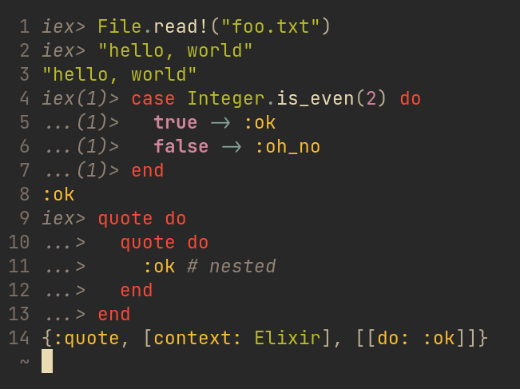

# `tree-sitter-iex`

A [tree-sitter](https://tree-sitter.github.io/tree-sitter/) grammar for Elixir's "IEx" REPL syntax

## Status

This grammar should be fairly complete. It could support more advanced iex syntax in the future, though, such as `iex(foo@name)1>`.

## Example highlights

Injecting [`elixir-lang/tree-sitter-elixir`](https://github.com/elixir-lang/tree-sitter-elixir):

